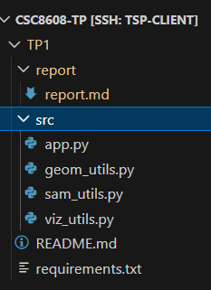
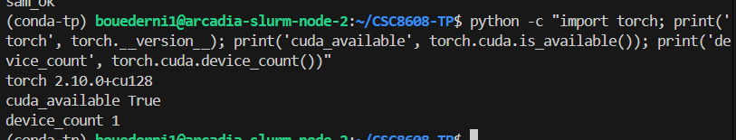
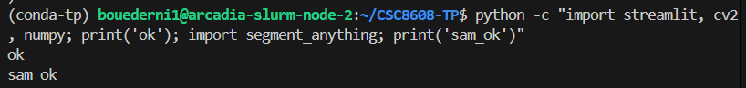
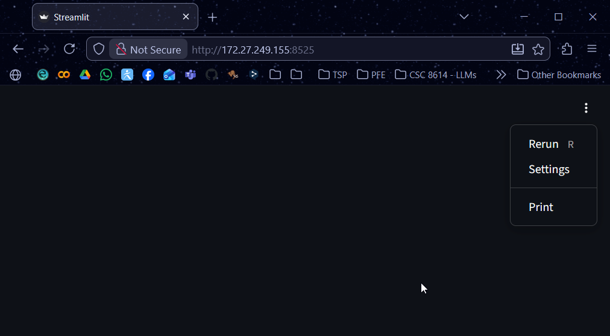

# Exercice 1 : Initialisation du dépôt, réservation GPU, et lancement de la UI via SSH

## Question 1.c.

- Lien du dépôt : https://github.com/bouederni/CSC8608-TP
- Endroit d'exécution du TP : Sur le SLURM de l'école
- Arborescence : 

Commandes d'activation : 
```bash
(conda-tp) bouederni1@arcadia-slurm-controller:~/CSC8608-TP$ srun --gres=gpu:1 --time=01:30:00 --cpus-per-task=4 --mem=16G --pty bash
(base) bouederni1@arcadia-slurm-node-2:~/CSC8608-TP$ conda activate conda-tp
```

## Question 1.e.


## Question 1.g.


## Question 1.i.
- Port choisi : `8525`

Commande de connexion : `ssh -L 0.0.0.0:8525:localhost:8525 bouederni1@nodeX-tsp`

Capture d'écran de l'app dans mon navigateur Web :


L'UI est bien accessible via un tunnel SSH vers mon WSL local, vu que je passe par lui pour me connecter au SLURM de l'école. C'est pourquoi je dois utiliser l'addresse IP de WSL au lieu de 0.0.0.0 pour me connecter à l'interface.

# Exercice 2 : Constituer un mini-dataset (jusqu’à 20 images)

## Question 2.b.

J'ai récupéré 20 images depuis le dataset ImageNet. 

Il s'agit d'images de divers animaux, avec des contextes qui varient beaucoup parmi les images. 
- Certaines des images (`bald_eagle`, `chickadee`) contiennent des éléments faciles à identifier (arrière-plan mat pour `bald_eagle` et flou d'arrière-plan pour `chickadee`).
- D'autres images sont beaucoup plus complexes à traiter :
    - `bullfrog` a des reflets qui rendent l'identification automatique du crapaud difficile, car seule sa tête dépasse de l'eau
    - `leatherbacfk_turtle` et `eft` possèdent plusieurs animaux de la même espèce se chevauchant entre eux


Cas simple (`bald_eagle`) : 


Cas difficile : 


