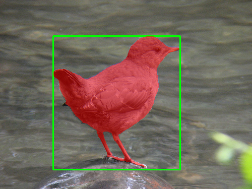
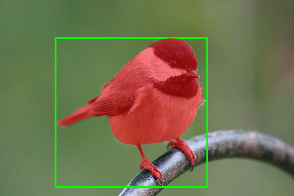
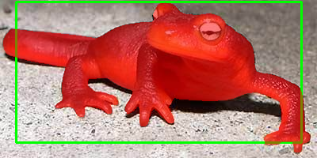
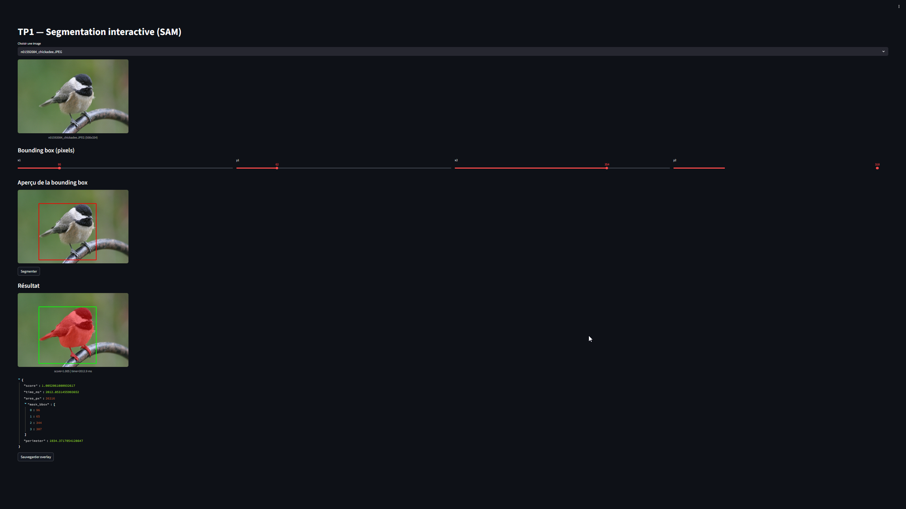
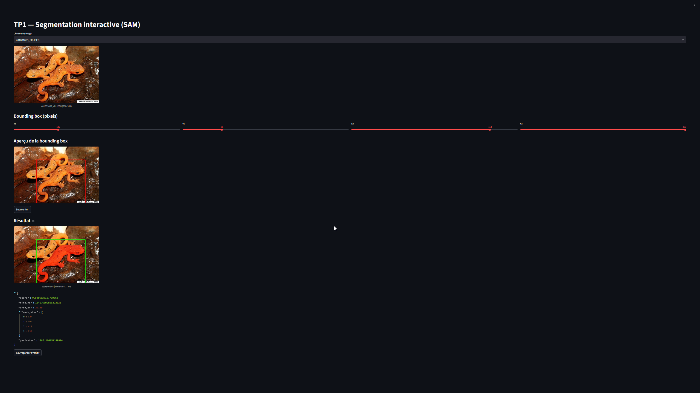
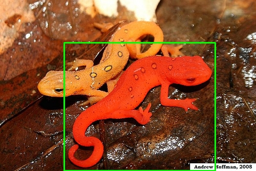
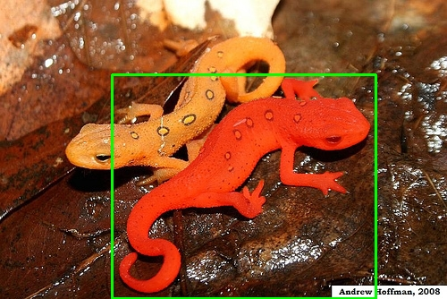
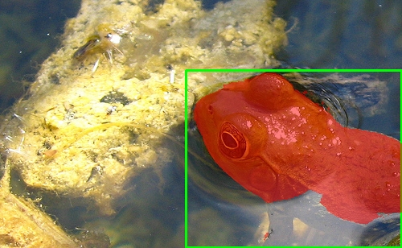
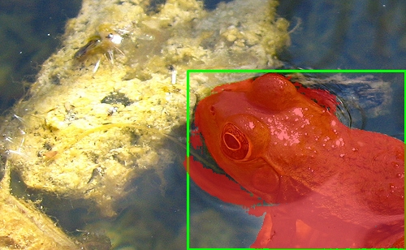
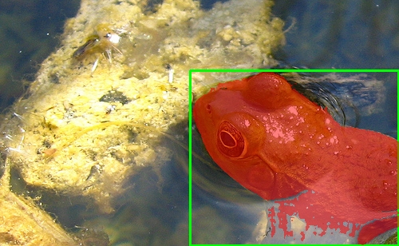

# Exercice 1 : Initialisation du dépôt, réservation GPU, et lancement de la UI via SSH

## Question 1.c.

- Lien du dépôt : https://github.com/bouederni/CSC8608-TP
- Endroit d'exécution du TP : Sur le SLURM de l'école
- Arborescence : 

Commandes d'activation : 
```bash
(conda-tp) bouederni1@arcadia-slurm-controller:~/CSC8608-TP$ srun --gres=gpu:1 --time=01:30:00 --cpus-per-task=4 --mem=16G --pty bash
(base) bouederni1@arcadia-slurm-node-2:~/CSC8608-TP$ conda activate conda-tp
```

## Question 1.e.


## Question 1.g.


## Question 1.i.
- Port choisi : `8525`

Commande de connexion : `ssh -L 0.0.0.0:8525:localhost:8525 bouederni1@nodeX-tsp`

Mon lien : `http://172.27.249.155:8525/` (je passe par WSL)

Capture d'écran de l'app dans mon navigateur Web :


L'UI est bien accessible via un tunnel SSH vers mon WSL local, vu que je passe par lui pour me connecter au SLURM de l'école. C'est pourquoi je dois utiliser l'addresse IP de WSL au lieu de 0.0.0.0 pour me connecter à l'interface.

# Exercice 2 : Constituer un mini-dataset (jusqu’à 20 images)

## Question 2.b.

J'ai récupéré 20 images depuis le dataset ImageNet. 

Il s'agit d'images de divers animaux, avec des contextes qui varient beaucoup parmi les images. 
- Certaines des images (`bald_eagle`, `chickadee`) contiennent des éléments faciles à identifier (arrière-plan mat pour `bald_eagle` et flou d'arrière-plan pour `chickadee`).
- D'autres images sont beaucoup plus complexes à traiter :
    - `bullfrog` a des reflets qui rendent l'identification automatique de la grenouille difficile, car seule sa tête dépasse de l'eau
    - `leatherbacfk_turtle` et `eft` possèdent plusieurs animaux de la même espèce se chevauchant entre eux


Cas simple (`bald_eagle`) : 


Cas difficile : 


# Exercice 3 : Charger SAM (GPU) et préparer une inférence “bounding box → masque”

## Question 3.e.

J'ai utilisé le modèle huge (`sam_vit_h_4b8939.pth`) car j'utilise SLURM pour faire tourner le TP.

- Image utilisée : `n01601694_water_ouzel.JPEG`

- bbox : `box = np.array([105, 71, 357, 336], dtype=np.int32)`


Capture d'écran de l'exécution :


Le modèle fonctionne parfaitement, sans lenteur observée (un temps d'exécution d'à peu près 15 secondes, mais j'imagine que c'est normal pour un tel modèle sur les machines de l'école)

# Exercice 4 : Mesures et visualisation : overlay + métriques (aire, bbox, périmètre)

## Question 4.d.

### Image 1 
- Image utilisée : `n01601694_water_ouzel.JPEG`
- bbox : `box = np.array([105, 71, 357, 336], dtype=np.int32)`
- Overlay produit : 



### Image 2 
- Image utilisée : `n01592084_chickadee.JPEG`
- bbox : `box = np.array([94, 64, 352, 318], dtype=np.int32)`
- Overlay produit :



### Image 3 
- Image utilisée : `n01630670_common_newt.JPEG`
- bbox : `box = np.array([20, 2, 380, 180], dtype=np.int32)`
- Overlay produit : 



- Ici, j'ai eu à réduire la taille de la bbox, car lorsque la bbox était ajustée de manière à contenir la salamandre en entier sans couper de bouts, j'obtenais un résultat qui sélectionnait tout sauf celle-ci. Après quelques ajustements, j'ai réussi à sélectionner l'ensemble de la salamandre avec cette taille de bbox.

### Résultats

| Image | Score | Aire (px²) | Périmètre (px) |
|-------|-------|------|-----------|
| n01601694_water_ouzel.JPEG | 1.0039 | 25488 | 958 |
| n01592084_chickadee.JPEG | 1.0049 | 26202 | 1032 |
| n01630670_common_newt.JPEG | 0.9846 | 30809 | 1420 |

L’overlay aide à debugger le modèle lorsqu’il existe un écart entre le score de confiance et la qualité réelle de la détection. Par exemple, un score élevé peut masquer une segmentation imprécise, un masque qui déborde sur l’arrière‑plan ou une détection partielle de l’objet. Il permet aussi d’identifier des erreurs liées au prompt, comme une mauvaise interprétation de la classe cible ou une confusion entre objets similaires. En visualisant directement les contours et les zones segmentées, on comprend si le problème vient du modèle ou des données d’entrée.

# Exercice 5 : Mini-UI Streamlit : sélection d’image, saisie de bbox, segmentation, affichage et sauvegarde

## Question 5.b.

J'ai réduit les tailles d'images et ajouté à app.py un aperçu de la bounding box pour que l'interface soit plus facile d'utilisation.

## Question 5.c.

Je n'avais pas lu cette question avant de faire mes modifications sur le code d'`app.py`. Cette question a été effectuée avec ma propre implémentation.

## Question 5.d.

### Captures d'écran

Exemple simple : 



Exemple plus compliqué : 



### Tableau

| Image | Score | Aire (px²) | Temps (ms) |
|-------|-------|------|-----------|
| n01644373_tree_frog.JPEG | 0.9828 | 66193 | 1645 |
| n01669191_box_turtle.JPEG | 0.9885 | 33806 | 1649 |
| n01631663_eft.JPEG | 0.9966 | 20129 | 1641 |

Je n'avais pas prélevé les valeurs de la bbox au moment de l'affichage du résultat.

Quand on rétrécit/agrandit la bbox, ça change la zone de référence pour le modèle, ce qui fait qu'il peut faire des prédictions erronnées, car il se base principalement sur la taille de la bbox pour identifier ce qu'il identifie.

# Exercice 6 : Affiner la sélection de l'objet : points FG/BG + choix du masque (multimask)

## Question 6.k.

### Première image

Image : `n01631663_eft.JPEG`

Test sans points : 



Test avec points : 



Points utilisés : 
- FG : 339, 98

On voit que j'ai réussi à inclure la patte avant-gauche du lézard en la sélectionnant avec un point FG.

J'ai sélectionné le masque à l'index 2. 

### Deuxième image

Image : 

Test sans points : 

Masque = 1



On voit que le modèle n'arrive pas à identifier la partie submergée de la grenouille.

Masque = 2



Ici, on voit le contraire.

Test avec points : 

Masque = 1



On réussit un peu mieux à capturer la partie sous-marine de la grenouille, mais c'est toujours très difficile.

Ensemble des points utilisés :


### Explication

Les points BG sont indispensables quand ce que l'on souhaite sélectionner est affecté par un changement global en luminance ou autre métrique de couleur. On peut voir ça avec l'exemple de l'image avec la grenouille, où le reflet de l'eau fait que la grenouille est difficile à identifier.

# Exercice 7 : Bilan et réflexion (POC vers produit) + remise finale

J'ai identifié plusieurs plans principaux d'échecs sur mes essais :
- Les reflets causent des fluctuations de couleur qui entravent la segmentation, car ils laissent penser à l'IA qu'ils font ou ne font pas partie de l'objet cherché. C'est visible sur l'exemple de la grenouille.
- Sur le test avec les lézards oranges, l'ambiguité sur l'appartenance ou non de la partie au lézard (à l'unité que le modèle essaie d'isoler) lui a fait manquer la patte avant gauche du lézard.
- J'avais aussi eu un souci lors du test avec la salamdre où le modèle sélectionnait l'arrière-plan plutôt que la salamandre elle-même, car elle l'avait identifié comme objet majoritaire dans la bbox.

Ces problèmes sont réglables par le biais d'ajustements (typiquement l'ajustement de la taille de la bbox, l'utilisation de points FG/BG)

## Question 7.b.

Pour passer en production, il est essentiel de mettre en place un monitoring clair et structuré de plusieurs signaux clés. 
- La distribution des scores de confiance (SAM Score) doit être suivie de près : une baisse progressive de la moyenne sur une semaine peut révéler un drift des données en entrée (changement de qualité, de luminosité ou apparition de nouveaux types d’objets). 
- Le temps de latence, notamment au niveau de l’Image Encoder, doit être surveillé pour détecter une éventuelle saturation GPU ou un besoin de scaling. Il est aussi important d’analyser le ratio entre l’aire du masque et l’aire de la bounding box : des valeurs proches de 0 ou de 1 signalent souvent une segmentation défaillante (masque vide ou boîte entièrement remplie). 
- Le taux d’interaction utilisateur constitue aussi un indicateur important. Enregistrer le nombre de points (FG/BG) ajoutés après le premier clic permet d’évaluer la qualité du modèle de base. Un nombre élevé suggère qu’il est peu adapté au cas d’usage. 
- La consommation de VRAM doit être monitorée, en particulier avec des images haute résolution (4K et plus), afin d’anticiper les pics mémoire et éviter les erreurs Out of Memory (OOM).