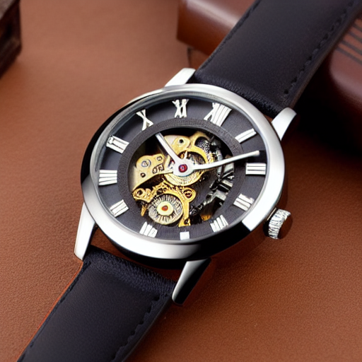
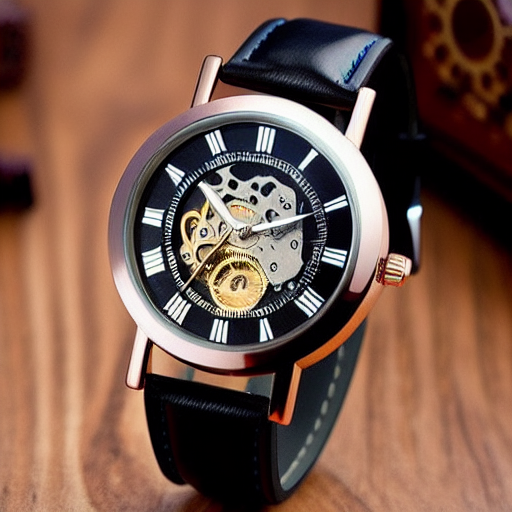
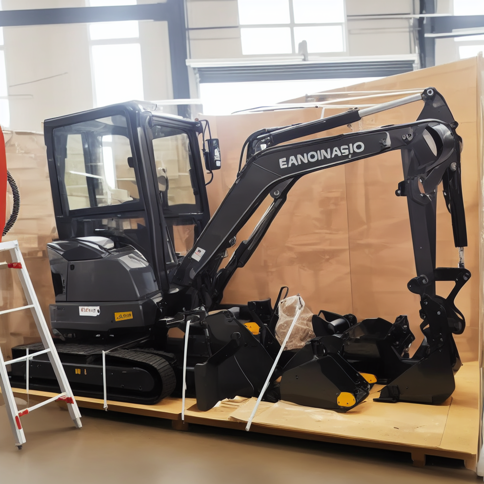
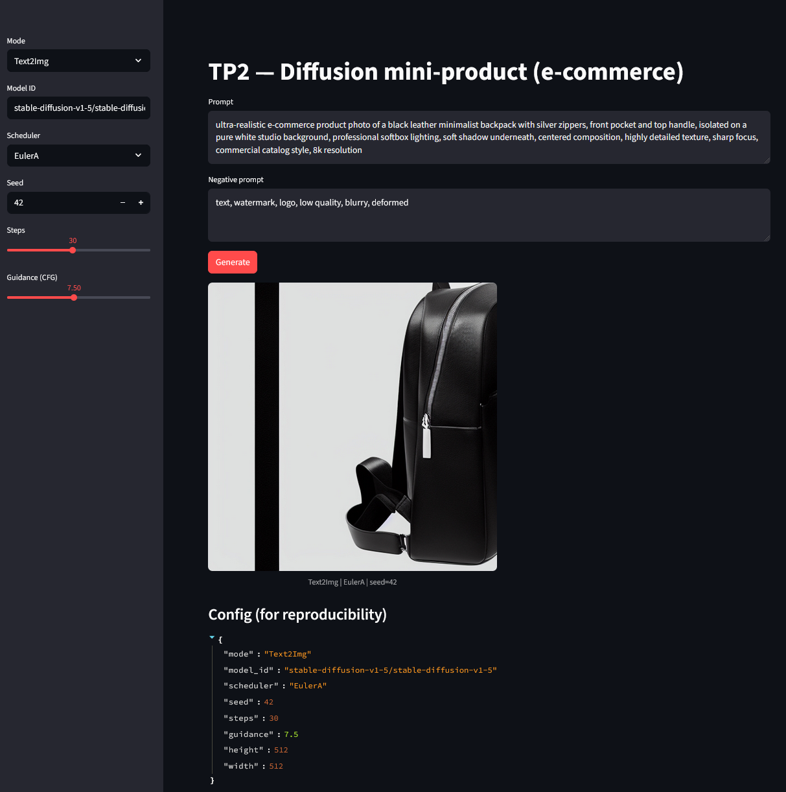
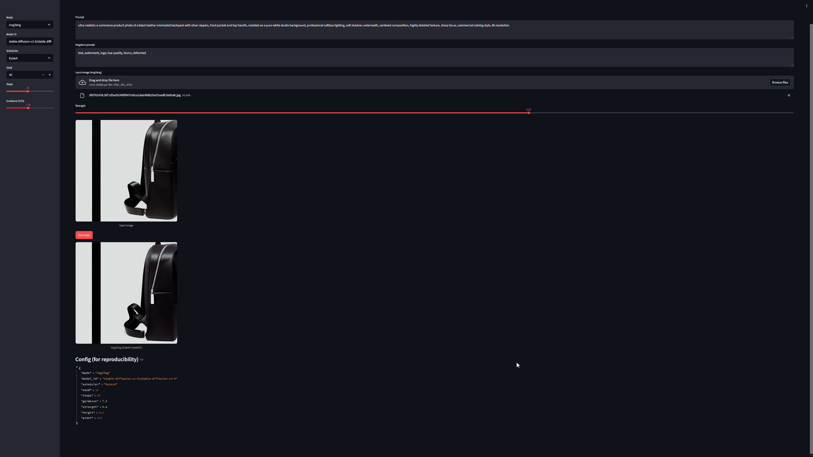

# Exercice 1 : Mise en place & smoke test (GPU + Diffusers)

## Question 1.c.

Je n'ai pas rencontré de soucis sur le smoke test.

# Exercice 2 : Factoriser le chargement du pipeline (text2img/img2img) et exposer les paramètres

## Question 2.b.

`CONFIG: {'model_id': 'stable-diffusion-v1-5/stable-diffusion-v1-5', 'scheduler': 'EulerA', 'seed': 42, 'steps': 30, 'guidance': 7.5}`

# Exercice 3 : Text2Img : 6 expériences contrôlées (paramètres steps, guidance, scheduler)

## Question 3.c.

| Run | Image | Analyse |
|-----|-------|---------|
| Baseline |  | Netteté ok mais distortions/artéfacts visibles très rapidement (aiguilles/heures/engrenages distordus) |
| 15 steps |  | Aspect plus "smooth" que l'image baseline, distortions très visibles à l'intérieur de la montre et sur l'ajusteur mais l'aspect lisse de l'image est lisse autour |
| 50 steps |  | Textures plus apparentes que les deux images précédentes. Visiblement, les détails précis sont plus travaillés. Les distortions sont toujours présentes mais visiblement moins prononcées |
| Guidance 4.0 |  | Netteté ok, artéfacts toujours visibles. L'image est visuellement distincte des images précédentes (angle différent, intérieur clair, ...) |
| Guidance 12.0 |  | Haute qualité visuelle malgré les artéfacts |
| Scheduler DDIM |  | Reflet lumineux visible sur la montre cette fois-ci |

Le paramètre *steps* (num_inference_steps) correspond au nombre d’itérations de débruitage effectuées par le modèle. Plus le nombre de steps est élevé, plus le processus de génération est progressif et précis, ce qui peut améliorer les détails et la stabilité de l’image. Cependant, au-delà d’un certain seuil, le gain visuel devient marginal tandis que le temps de calcul augmente significativement.

Le paramètre *guidance* (guidance_scale) contrôle la force du conditionnement par le prompt via la technique de classifier-free guidance. Une valeur faible laisse davantage de liberté au modèle mais peut produire des images moins fidèles au texte. Une valeur élevée renforce l’alignement avec le prompt, au risque d’introduire des artefacts ou un rendu moins naturel si elle est excessive.

Le *scheduler* détermine la stratégie numérique utilisée pour retirer le bruit à chaque étape. Il influence la trajectoire de débruitage, la netteté et le style final de l’image, ainsi que la rapidité de convergence. Par exemple, un scheduler comme EulerA favorise généralement un bon compromis pour un nombre modéré de steps.

# Exercice 4 : Img2Img : 3 expériences contrôlées (strength faible/moyen/élevé)

Source de mon image : [https://fr.aliexpress.com/item/1005010503574150.html]()

## Question 4.c.

| Run | Image | Analyse |
|-----|-------|---------|
| Baseline |  | Image très similaire à l'image source à première vue. Image globalement simplifiée, texte illisible (typique des IA génératives d'images) |
| 15 steps |  | Image moins similaire. Arrière-plan flouté et design de la pelleteuse visuellement distinct et manquant de sens |
| 50 steps |  | Image visuellement totalement distincte de l'image originelle. Aspect beaucoup plus jaune/noir et arrière-plan totalement absent. Design incohérent. |

Dans un contexte e-commerce, un strength faible est généralement préférable car il permet d’améliorer le fond, la lumière et la netteté tout en conservant fidèlement le produit réel. Ça garantit que l’image reste représentative de l’article vendu, ce qui est essentiel pour éviter toute ambiguïté ou déception client.

Avec un strength élevé, le modèle peut modifier la forme, les proportions, certains composants ou même des détails techniques de l'article. On obtient alors une image plus créative ou plus “propre”, mais potentiellement éloignée du produit réel. En e-commerce, cela pose un risque de non-conformité visuelle, pouvant induire en erreur l’acheteur et nuire à la crédibilité de la fiche produit.

# Exercice 5 : Mini-produit Streamlit (MVP) : Text2Img + Img2Img avec paramètres

## Question 5.c.

# Exercice 6 : Évaluation (léger) + réflexion (à finir à la maison)

## Grille d'évaluation

- Prompt adherence (0–2) : À quel point l'image générée est cohérente avec le prompt qu'on a donné en entrée
- Visual realism (0–2) : À quel point l'image en sortie est réaliste (bonne métrique car j'ai généré toutes mes images en demandant un résultat réaliste dans le prompt)
- Artifacts (0–2) — 2 = aucun artefact gênant : À quel point l'image ne présente pas d'artéfacts visuels (distortions, déformations, objets non reconnaissables, ...)
- E-commerce usability (0–2) — 2 = publiable après retouches mineures : À quel point l'image est utilisable dans un contexte de e-commence
- Reproducibility (0–2) — 2 = paramètres suffisants pour reproduire : À quel point l'image est reproductible en conservant les mêmes paramètres d'entrée (seed, steps, guidance, strength, image d'entrée, scheduler, modèle...)

| Image | Prompt adherence (0–2) | Visual realism (0–2) | Artifacts (0–2) | E-commerce usability (0–2) | Reproducibility (0–2) | Note finale |
|-------|------------------------|----------------------|-----------------|----------------------------|------------------------|-----------|
||1.5|1|0.5|1|1|5/10|
||2|1.5|1|1|2|7.5/10|
||1|0|0.5|0|0|1.5/10|

- Pour la première image, malgré le fait qu'elle soit cohérente à première vue, on remarque très vite des inconsistances
- Pour la deuxième image, elle semble la plus réaliste des trois que j'ai sélectionnées.
- Pour la troisième, elle est totalement incohérente visuellement et on ne comprend rien quand on la regarde

L’augmentation du nombre de *steps* améliore généralement la finesse des détails et la stabilité globale de l’image, mais le gain devient rapidement marginal au regard de l’augmentation du temps d’inférence et donc du coût de calcul. Le choix du *scheduler* influence aussi ce compromis : certains produisent des résultats plus nets en moins d’itérations, tandis que d’autres privilégient la stabilité au prix d’une latence plus élevée. Dans un contexte contraint (prototype, batch massif), il est donc nécessaire d’identifier un point d’équilibre plutôt que de chercher la qualité maximale absolue.

La reproductibilité repose sur la maîtrise de l’ensemble des paramètres : *seed*, nombre de *steps*, *guidance scale*, *strength* en Img2Img, modèle exact et *scheduler*. Une simple modification de version du modèle ou l’oubli du seed peut produire une image sensiblement différente. Même avec les mêmes réglages, un changement matériel ou logiciel peut introduire de légères variations.

En e-commerce, les risques sont concrets : hallucination de détails inexistants, altération subtile du design, ajout ou déformation de logos et de textes, voire création d’éléments non conformes au produit réel. Cela peut induire le client en erreur et poser des problèmes juridiques ou réglementaires. Pour limiter ces dérives, je privilégierais des *strength* faibles à modérés modérés en Img2Img, des prompts strictement descriptifs, une vérification humaine systématique et, si possible, une comparaison automatique avec l’image source afin de détecter les écarts structurels significatifs.