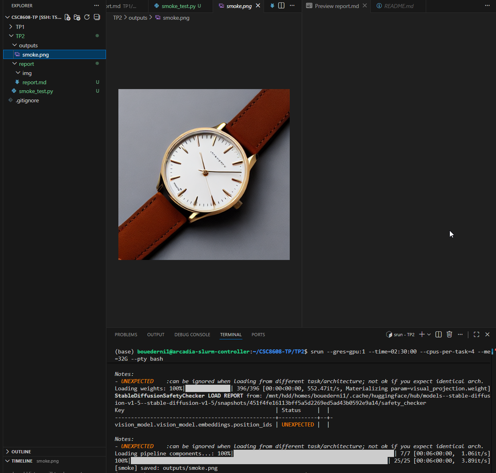
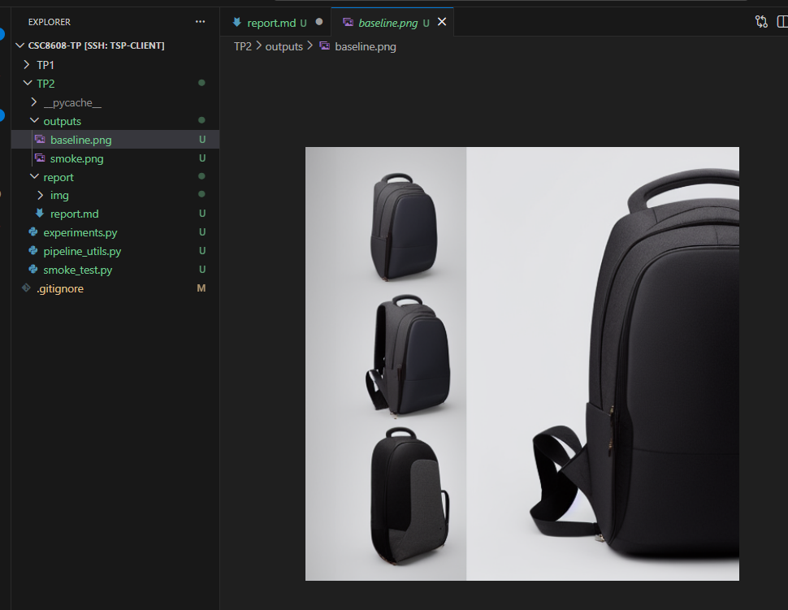

# Exercice 1 : Mise en place & smoke test (GPU + Diffusers)

## Question 1.c.

Je n'ai pas rencontré de soucis sur le smoke test.

# Exercice 2 : Factoriser le chargement du pipeline (text2img/img2img) et exposer les paramètres

## Question 2.b.

`CONFIG: {'model_id': 'stable-diffusion-v1-5/stable-diffusion-v1-5', 'scheduler': 'EulerA', 'seed': 42, 'steps': 30, 'guidance': 7.5}`

