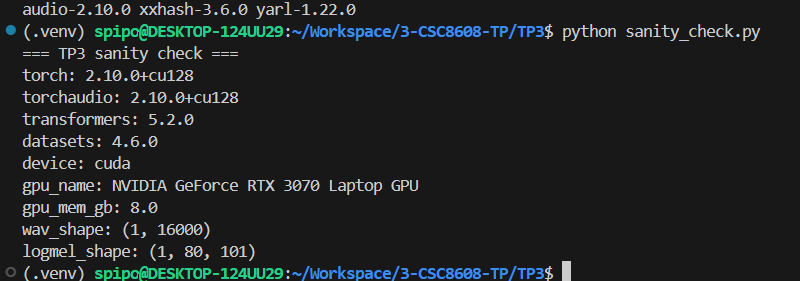
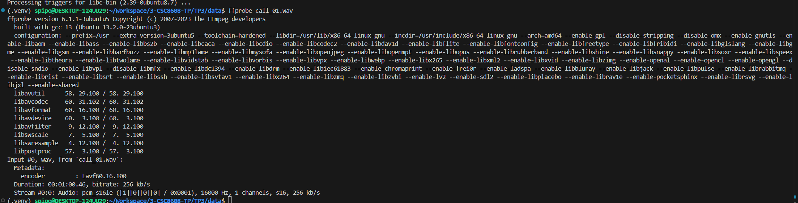
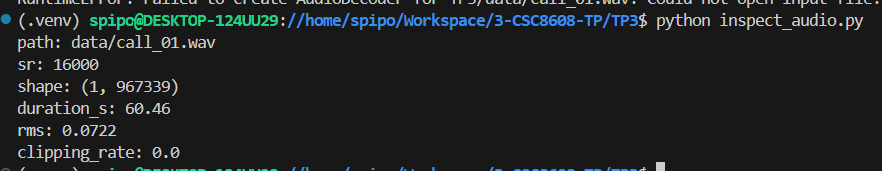
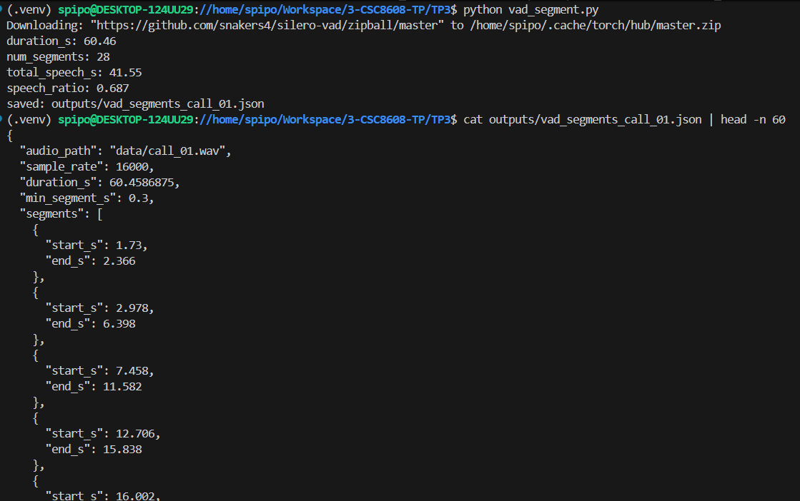
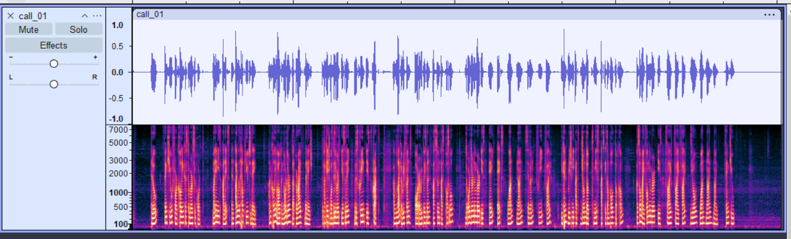

# Exercice 1 : Initialisation du TP3 et vérification de l’environnement

## Question 1.c.

# Exercice 2 : Constituer un mini-jeu de données : enregistrement d’un “appel” (anglais) + vérification audio

## Question 2.b.

J'ai utilisé l'enregistrement audio de mon camarade Robert car je réalise actuellement ce TP dans un train.

## Question 2.e.

# Exercice 3 : VAD (Voice Activity Detection) : segmenter la parole et mesurer speech/silence

## Question 3.b.

## Question 3.c.

Le ratio à 0.687 (68.7%) colle bien avec la lecture dans le fichier audio. Robert avait fait des pauses dans sa lecture pour faire tenir l'enregistrement à 1 minute, et les 31% semblent bel et bien coller avec les temps de pause qu'il a marqué.

Voici le fichier ouvert dans Audacity : 

On y remarque bien les temps de pause.

## Question 3.d.

En passant de 0.30 à 0.60 : 
- `num_segments` est passé de 28 à 24
- total_speech_s a baissé de 41.55s à 39.46s
- Le ratio a (par conséquent) baissé de 0.687 à 0.653

# Exercice 4 : ASR avec Whisper : transcription segmentée + mesure de latence

# Exercice 5 : Call center analytics : redaction PII + intention + fiche appel

# Exercice 6 : TTS léger : générer une réponse “agent” et contrôler latence/qualité

# Exercice 7 : Intégration : pipeline end-to-end + rapport d’ingénierie (léger)

