# Exercice 1 : Initialisation du TP3 et vérification de l’environnement

## Question 1.c.

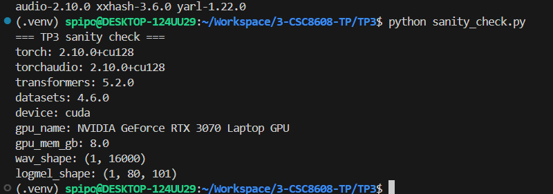

# Exercice 2 : Constituer un mini-jeu de données : enregistrement d’un “appel” (anglais) + vérification audio

## Question 2.b.

J'ai utilisé l'enregistrement audio de mon camarade Robert car je réalise actuellement ce TP dans un train.

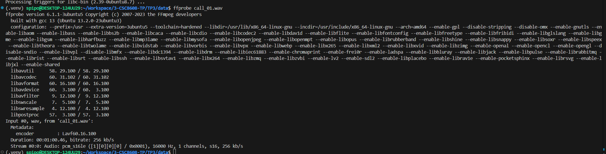

## Question 2.e.

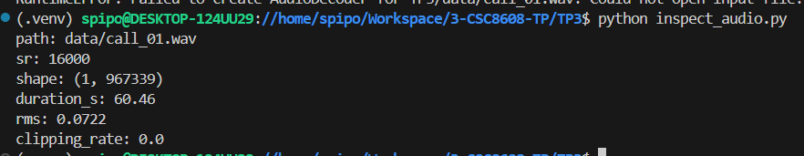

# Exercice 3 : VAD (Voice Activity Detection) : segmenter la parole et mesurer speech/silence

## Question 3.b.

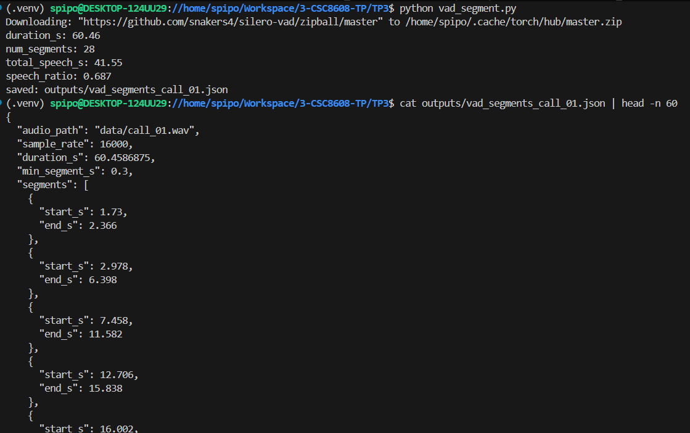

## Question 3.c.

Le ratio à 0.687 (68.7%) colle bien avec la lecture dans le fichier audio. Robert avait fait des pauses dans sa lecture pour faire tenir l'enregistrement à 1 minute, et les 31% semblent bel et bien coller avec les temps de pause qu'il a marqué.

Voici le fichier ouvert dans Audacity : 

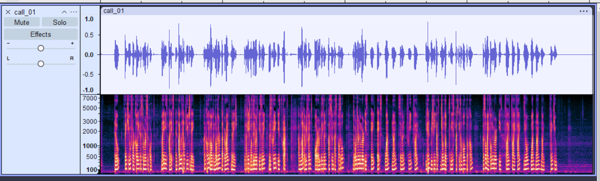

On y remarque bien les temps de pause.

## Question 3.d.

En passant de 0.30 à 0.60 : 
- `num_segments` est passé de 28 à 24
- total_speech_s a baissé de 41.55s à 39.46s
- Le ratio a (par conséquent) baissé de 0.687 à 0.653

# Exercice 4 : ASR avec Whisper : transcription segmentée + mesure de latence

## Question 4.b.

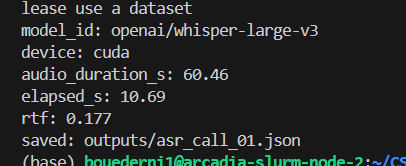

## Question 4.c.

Extrait de l'output `TP3/outputs/asr_call_01.json` :
```json
(base) bouederni1@arcadia-slurm-node-2:~/CSC8608-TP/TP3$ cat outputs/asr_call_01.json | ead -n 120
{
  "audio_path": "data/call_01.wav",
  "model_id": "openai/whisper-large-v3",
  "device": "cuda",
  "audio_duration_s": 60.4586875,
  "elapsed_s": 10.694388151168823,
  "rtf": 0.17688753417230274,
  "segments": [
    {
      "segment_id": 0,
      "start_s": 1.73,
      "end_s": 2.366,
      "text": "Hello?"
    },
    {
      "segment_id": 1,
      "start_s": 2.978,
      "end_s": 6.398,
      "text": "Thank you for calling customer support."
    },
    {
      "segment_id": 2,
      "start_s": 7.458,
      "end_s": 11.582,
      "text": "My name is Alex and I will help you today."
    },
    {
      "segment_id": 3,
      "start_s": 12.706,
      "end_s": 15.838,
      "text": "I'm calling about an order that arrived"
    },
    {
      "segment_id": 4,
      "start_s": 16.002,
      "end_s": 16.766,
      "text": "the mage."
    },
    [...]
```
## Question 4.d.

- On constate sur le segments avec ID 3 et 4 qu'une phrase a été segmentée en deux, avec le deuxième segment semblant trop court et insensé.
- Globalement, la segmentation VAD semble aider la transcription en réduisant le bruit et en nullifiant les segments silencieux (on n'en trouve pas dans le fichier `asr_call_01.json`) mais certains segments semblent être malformés / trop courts (par exemple, une même phrase s'étend sur 7 segments au total (de 7 à 14)).

# Exercice 5 : Call center analytics : redaction PII + intention + fiche appel

## Question 5.b.

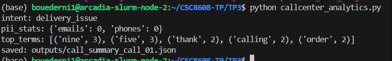

## Question 5.c.

Extrait de l'output `TP3/outputs/asr_call_01.json` :
```json
{
  "audio_path": "data/call_01.wav",
  "model_id": "openai/whisper-large-v3",
  "device": "cuda",
  "audio_duration_s": 60.4586875,
  "elapsed_s": 10.694388151168823,
  "rtf": 0.17688753417230274,
  "pii_stats": {
    "emails": 0,
    "phones": 0
  },
  "intent_scores": {
    "refund_or_replacement": 3,
    "delivery_issue": 6,
    "general_support": 6
  },
  "intent": "delivery_issue",
  "top_terms": [
    [
      "nine",
      3
    ],
    [
      "five",
      3
    ],
    [
      "thank",
      2
    ],
    [
      "calling",
      2
    ],
    [
      "order",
      2
    ],
[...]
```

## Question 5.e.

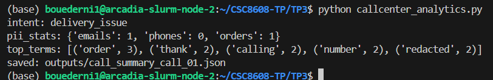

On remarque quelques différences : 
- d'abord, dans pii_stats, on remarque qu'une adresse mail a été détectée, ainsi qu'un numéro de commande, ce qui n'était pas le cas dans mon essai précédent ;
- les "top_terms" ne contiennent maintenant que des mots, et non plus de digits comme c'était le cas avant.

## Question 5.f.

Les erreurs de Whisper qui pèsent le plus sur les analytics sont :
- les erreurs sur mots-clés d'intention (faux négatifs/faux positifs)
- la mauvaise reconnaissance de digits (PII manquantes/fragmentées)
- les confusions sur les termes métier/négations qui changent le sens.

Dans mon cas, lors de la première itération, Whisper avait transcrit plusieurs chiffres en mots et n'a initialement détecté aucun email.

# Exercice 6 : TTS léger : générer une réponse “agent” et contrôler latence/qualité

## Question 6.b.

Output de `python TP3/tts_reply.py` : 
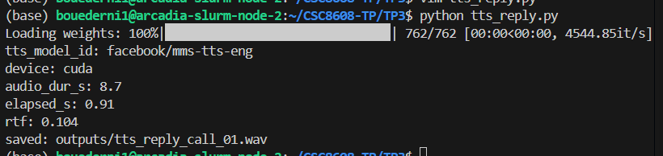

## Question 6.c.

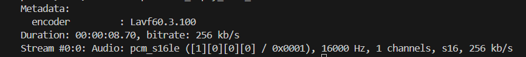

## Question 6.d.

La prononciation est claire et intelligible. La séparation des phrases est correcte. La prosodie est un peu monotone avec variations d'intonations limitées. Aucun artéfact métallique prononcé n'est présent, et aucune coupure n'est détectée. 

Durée ~8.7 s, RTF ≈ 0.3 -> latence compatible temps réel.

## Question 6.e.

Output de `python asr_tts_check.py` : 

```
model_id: openai/whisper-small
elapsed_s: 1.64
text: Thanks for calling, I am sorry your order arrived, damaged, I can offer a replacement or a refund, please confirm your preferred option.
```

On constate ici une intelligibilité élevée. La transcription capture correctement le contenu et l'ordre des phrase. On constate juste un usage inexact de symboles de ponctuation (l'usage exact aurait ici été "[...] your order arrived damaged. I can offer [...]")

# Exercice 7 : Intégration : pipeline end-to-end + rapport d’ingénierie (léger)

## Question 7.b.

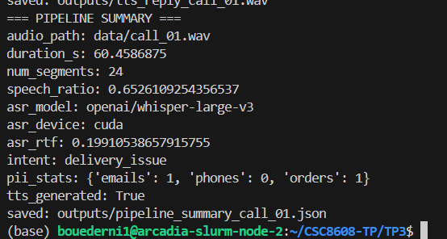

## Question 7.c.

Contenu du fichier `outputs/pipeline_summary_call_01.json`
```json
{
  "audio_path": "data/call_01.wav",
  "duration_s": 60.4586875,
  "num_segments": 24,
  "speech_ratio": 0.6526109254356537,
  "asr_model": "openai/whisper-large-v3",
  "asr_device": "cuda",
  "asr_rtf": 0.19910538657915755,
  "intent": "delivery_issue",
  "pii_stats": {
    "emails": 1,
    "phones": 0,
    "orders": 1
},
"tts_generated": true
```
## Question 7.d.

Le "goulet d'étranglement" principal est l'étape ASR (Whisper). C'est celle qui prend le plus de temps d'inférence par seconde d'audio (RTF) et représente la plus grande partie de la latence côté utilisateur.

L'étape la plus fragile est la détection de voix (VAD). Les erreurs de segmentation pouvant se produire (fausses détections ou découpes au mauvais endroit) nuisent directement à l’ASR et aux métriques downstream.

Comme améliorations, on pourrait : 
- mettre en pipeline asynchrone & batching -> on exécuterait les étapes VAD/ASR en streaming/workers parallèles, et on pourrait batcher les segments cours pour réduire les overheads et optimiser l'utilisation des ressources ;
- mettre en place un post-traitement robuste des transcriptions -> on pourrait appliquer une normalisation de texte, une correction orthographique et des règles heuristiques (contraction, ponctuation, fusion de segments...) pour réduire les erreurs de découpe et améliorer l'intelligibilité sans avoir à ré-entraîner le modèle ;
- ajouter des métriques automatiques (RTF, WER approximatif, taux de segments courts) + alerting/fallback (ré-essais en modes différents) pour maintenir la disponibilité.