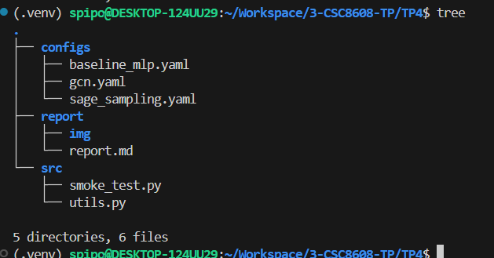
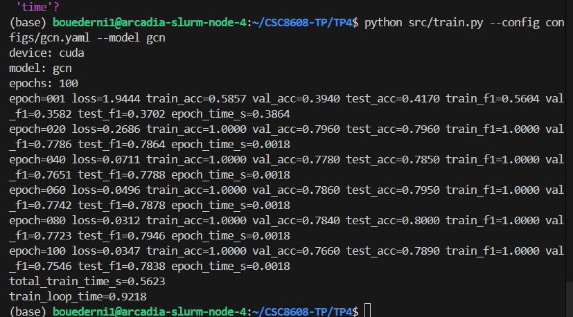
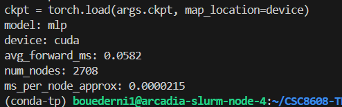
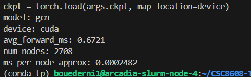
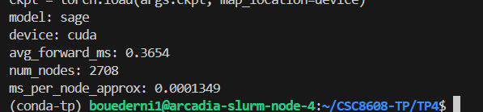

# Exercice 1 : Initialisation du TP et smoke test PyG (Cora)

## Question 1.a.



## Question 1.e. 

Sortie du smoke test : 
```
(base) bouederni1@arcadia-slurm-node-4:~/CSC8608-TP/TP4$ python src/smoke_test.py 
=== Environment ===
torch: 2.10.0+cu128
cuda available: True
device: cuda
gpu: NVIDIA H100 NVL
gpu_total_mem_gb: 93.12

=== Dataset (Cora) ===
Downloading https://github.com/kimiyoung/planetoid/raw/master/data/ind.cora.x
Downloading https://github.com/kimiyoung/planetoid/raw/master/data/ind.cora.tx
Downloading https://github.com/kimiyoung/planetoid/raw/master/data/ind.cora.allx
Downloading https://github.com/kimiyoung/planetoid/raw/master/data/ind.cora.y
Downloading https://github.com/kimiyoung/planetoid/raw/master/data/ind.cora.ty
Downloading https://github.com/kimiyoung/planetoid/raw/master/data/ind.cora.ally
Downloading https://github.com/kimiyoung/planetoid/raw/master/data/ind.cora.graph
Downloading https://github.com/kimiyoung/planetoid/raw/master/data/ind.cora.test.index
Processing...
(6 messages de déprecation)
Done!
num_nodes: 2708
num_edges: 10556
num_node_features: 1433
num_classes: 7
train/val/test: 140 500 1000

OK: smoke test passed.
```

# Exercice 2 : Baseline tabulaire : MLP (features seules) + entraînement et métriques

## Question 2.g.

On calcule séparément sur train, val et test pour respecter un protocole d’évaluation reproductible et éviter le biais d’évaluation. Le train permet de suivre l’optimisation du modèle et détecter under/overfitting. La validation sert à comparer et régler hyperparamètres (early stopping, lr, etc.) sans utiliser les données de test. Le test, gardé à part, donne une estimation non biaisée de la performance finale sur données inédites. Mesurer toutes les trois séparément aide aussi à diagnostiquer les problèmes (fuite de données, surapprentissage, sous-apprentissage).

## Question 2.h.



# Exercice 3 : Baseline GNN : GCN (full-batch) + comparaison perf/temps

## Question 3.e.


| modèle | test_acc | test_f1 | temps (s) |
|---|---:|---:|---:|
| MLP | 0.5760 | 0.5593 | 0.8369 |
| GCN | 0.7890 | 0.7838 | 0.9218 |

## Question 3.f.

Le GCN utilise le graphe : il regarde les voisins d’un nœud et moyenne leurs caractéristiques pour enrichir sa représentation. Sur Cora, où les nœuds connectés ont souvent la même étiquette (forte homophilie), ce voisinage apporte un signal utile que le MLP, qui traite chaque nœud isolément, ne voit pas, d’où souvent de meilleures performances. En revanche, si les features individuelles sont déjà très discriminantes, ou si le graphe est bruyant/hétérophile, le GCN n’apportera que peu (ou rien) et peut même nuire via un “lissage” excessif qui efface les différences entre classes. Le gain dépend donc aussi du nombre de couches et des hyperparamètres : trop de propagation = over‑smoothing, trop peu = pas assez d’information de voisinage.

# Exercice 4 : Modèle principal : GraphSAGE + neighbor sampling (mini-batch)

## Question 4.e.

```
(base) bouederni1@arcadia-slurm-node-4:~/CSC8608-TP/TP4$ python src/train.py --config configs/sage_sampling.yaml --model sage
device: cuda
model: sage
epochs: 100
epoch=001 loss=1.8723 train_acc=0.4720 val_acc=0.2400 test_acc=0.2375 epoch_time_s=0.3621
epoch=025 loss=0.1895 train_acc=0.9940 val_acc=0.7420 test_acc=0.7520 epoch_time_s=0.0072
epoch=050 loss=0.0392 train_acc=1.0000 val_acc=0.7850 test_acc=0.7920 epoch_time_s=0.0051
epoch=075 loss=0.0208 train_acc=1.0000 val_acc=0.7880 test_acc=0.7955 epoch_time_s=0.0049
epoch=100 loss=0.0112 train_acc=1.0000 val_acc=0.7900 test_acc=0.7980 test_f1=0.7889 epoch_time_s=0.0048
total_train_time_s=0.9024
train_loop_time=1.0347
```

## Question 4.f.

Le neighbor sampling remplace l'agrégation complète des voisins par un sous-ensemble aléatoire de taille fixe (fanout), ce qui réduit  drastiquement le coût CPU et permet la scalabilité sur graphes massifs. 

Le compromis : l'estimateur du gradient devient bruité (variance stochastique plus haute), ralentissant la convergence si le fanout est trop petit. Un second risque est l'effet "hubs" où les nœuds très connectés sont sur-échantillonnés tandis que les nœuds isolés reçoivent moins de signal. 

En pratique, le fanout doit être ajusté : petit (2–4) pour la scalabilité mais gradient bruyant, modéré (8–16) pour un équilibre coût/qualité.

# Exercice 5 : Benchmarks ingénieur : temps d’entraînement et latence d’inférence (CPU/GPU)

## Question 5.d.





| Modèle    | Test Acc | Test F1 | Total Train Time (s) | avg_forward_ms |
|-----------|---------:|--------:|---------------------:|---------------:|
| MLP       | 0.5628   | 0.5309  | 0.1791               | 0.0569         |
| GCN       | 0.8037   | 0.7964  | 0.8603               | 0.6784         |
| GraphSAGE | 0.7992   | 0.7895  | 0.8536               | 0.3691         |

## Question 5.e.

- Warmup : on exécute quelques itérations avant de mesurer pour amener le GPU et le runtime dans un état représentatif (charger kernels, allouer caches, amortir coûts d’initialisation JIT et transfert de mémoire). Sans warmup la première itération inclut ces surcoûts et fausse la mesure moyenne.
- Les appels CUDA sont asynchrones : ils retournent au CPU avant que le GPU ait fini. On appelle cudaDeviceSynchronize() juste avant la mesure pour garantir que rien n’est en cours, puis juste après pour attendre la fin réelle du travail mesuré. Sinon, on obtient des temps sous‑estimés ou très bruités.

# Exercice 6 : Synthèse finale : comparaison, compromis, et recommandations ingénieur

## Question 6.b.

| Modèle      | test_acc | test_macro_f1 | total_train_time_s | train_loop_time | avg_forward_ms |
|------------|----------|---------------|--------------------|----------------|----------------|
| MLP        | 0.5628   | 0.5309        | 0.1791             | 1.3125         | 0.0569         |
| GCN        | 0.8037   | 0.7964        | 0.8603             | 1.4992         | 0.6784         |
| GraphSAGE  | 0.7992   | 0.7895        | 0.8536             | 1.2987         | 0.3691        

## Question 6.c.

- Si la priorité est la qualité (macro‑F1/accuracy) et que le graphe reste de taille limitée et stable, choisir GCN : il offre la meilleure accuracy et F1 (GCN: test_acc ≈ 0.8037, test_f1 ≈ 0.7964) tout en conservant un temps d'entraînement acceptable dans ce contexte. Pour des déploiements où l'on recherche la meilleure performance prédictive à coût de calcul modéré en inférence, GCN est approprié.
- Si l'on vise la maîtrise des coûts d'inférence et la scalabilité vers de grands graphes dynamiques, préférer GraphSAGE : ses coûts d'inférence sont intermédiaires mais il supporte le sampling et la montée en charge; GraphSAGE ici donne test_acc ≈ 0.7992, test_f1 ≈ 0.7895 avec latence moyenne par forward plus faible que GCN (avg_forward_ms ≈ 0.3691 vs 0.6784), ce qui réduit la latence en production sur gros graphes ou requêtes fréquentes.
- Si le graphe n’apporte qu’un gain marginal par rapport aux features tabulaires, ou si la contrainte est la latence extrême et la simplicité opérationnelle, choisir MLP : il a la latence la plus basse (avg_forward_ms ≈ 0.0569) et un coût d'entraînement très faible (total_train_time_s ≈ 0.1791), et reste pertinent quand la qualité supplémentaire due au graphe est limitée (MLP test_acc ≈ 0.5628, test_f1 ≈ 0.5309).

## Question 6.d.

Un risque fréquent est l'incohérence d'environnement : comparer modèles avec GPU chaud/froid, CPU vs GPU, ou sans warmup/synchronisation fausse latences. De même, absence de seeds ou splits identiques peut introduire variance ou leakage favorisant un modèle. Pour éviter cela en projet : standardiser le hardware et drivers, effectuer warmup et cudaDeviceSynchronize() autour des mesures, fixer les seeds et réutiliser les mêmes splits, isoler les jobs et exécuter plusieurs runs pour rapporter moyenne +/- écart‑type : ainsi les comparaisons deviennent robustes et reproductibles.