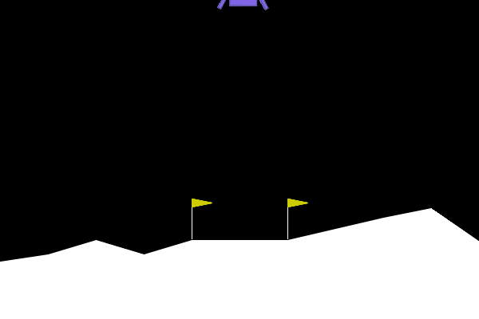
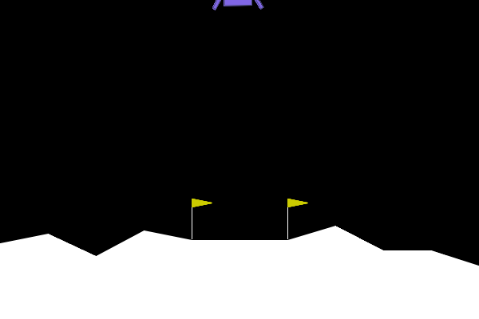

# Exercice 1 : Comprendre la Matrice et Instrumenter l'Environnement (Exploration de Gymnasium)

## Question 1.b.

Exécution : 
```
(.venv) spipo@DESKTOP-124UU29:~/Workspace/3-CSC8608-TP/TP5$ python random_agent.py 
/home/spipo/Workspace/3-CSC8608-TP/.venv/lib/python3.12/site-packages/pygame/pkgdata.py:25: UserWarning: pkg_resources is deprecated as an API. See https://setuptools.pypa.io/en/latest/pkg_resources.html. The pkg_resources package is slated for removal as early as 2025-11-30. Refrain from using this package or pin to Setuptools<81.
  from pkg_resources import resource_stream, resource_exists
Espace d'observation (Capteurs) : Box([ -2.5        -2.5       -10.        -10.         -6.2831855 -10.
  -0.         -0.       ], [ 2.5        2.5       10.        10.         6.2831855 10.
  1.         1.       ], (8,), float32)
Espace d'action (Moteurs) : Discrete(4)

--- RAPPORT DE VOL ---
Issue du vol : CRASH DÉTECTÉ 💥
Récompense totale cumulée : -98.98 points
Allumages moteur principal : 17
Allumages moteurs latéraux : 41
Durée du vol : 78 frames
Vidéo de la télémétrie sauvegardée sous 'random_agent.gif'
```

## Question 2.b.


La récompense totale est inférieure à l'exercice précédent. Visiblement, l'IA évite de s'écraser comme dans la dernière simulation, mais part totalement à droite.

ep_raw_mean semble avoir oscillé entre 0 et -20.

```
--- RAPPORT DE VOL PPO ---
Issue du vol : CRASH DÉTECTÉ 💥
Récompense totale cumulée : -107.06 points
Allumages moteur principal : 198
Allumages moteurs latéraux : 138
Durée du vol : 348 frames
```

# Exercice 3 : L'Art du Reward Engineering (Wrappers et Hacking)

## Question 3.b.



```
Issue du vol : CRASH DÉTECTÉ 💥
Récompense totale cumulée : -115.41 points
Allumages moteur principal : 0
Allumages moteurs latéraux : 77
Durée du vol : 77 frames
```

L’agent adopte une stratégie d’évitement total du moteur principal. Il n’allume jamais la poussée verticale et laisse le module chuter ou dériver passivement, utilisant au mieux les propulseurs latéraux peu pénalisés. Mathématiquement, la récompense cumulée $( R = \sum_t r_t )$ est dominée par la pénalité de −50 associée au moteur principal, bien supérieure aux faibles récompenses d’un atterrissage réussi. Toute trajectoire impliquant une seule activation devient sous‑optimale. L’optimum consiste donc à minimiser l’espérance de pénalité immédiate, même si cela réduit la probabilité de succès. Logiquement, l’agent maximise la fonction modifiée, pas l’objectif réel d’atterrissage sûr.

# 

## Question 4.b.

```
--- RAPPORT DE VOL PPO (GRAVITÉ MODIFIÉE) ---
Issue du vol : CRASH DÉTECTÉ 💥
Récompense totale cumulée : -78.40 points
Allumages moteur principal : 118
Allumages moteurs latéraux : 310
Durée du vol : 435 frames
```



Ici, le vaisseau commence par s'élever un peu par rapport au point de départ et corrige son thruster bas pour se baisser doucement, mais il se décentre comme dans les derniers essais. 

# Exercice 5 : Bilan Ingénieur : Le défi du Sim-to-Real

## Question 5.a.

Pour rendre l’agent robuste aux variations de gravité et de vent sans entraîner un modèle distinct par lune, une première stratégie consiste à utiliser la domain randomization : à chaque épisode, on échantillonne aléatoirement la gravité, la force du vent ou la masse du module dans des plages réalistes. L’agent apprend ainsi une politique qui maximise l’espérance de récompense sur une distribution d’environnements, et non sur une physique unique, ce qui limite le surapprentissage et améliore la généralisation.

Une deuxième approche consiste à enrichir l’espace d’observation en fournissant explicitement les paramètres physiques (gravité estimée, intensité du vent) en entrée du réseau. Le modèle apprend alors une politique conditionnelle capable d’adapter dynamiquement ses actions au contexte courant, sans multiplier les modèles ni modifier l’algorithme PPO.