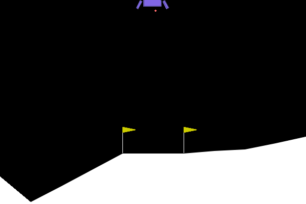

# Exercice 1 : Comprendre la Matrice et Instrumenter l'Environnement (Exploration de Gymnasium)

## Question 1.b.

Exécution : 
```
(.venv) spipo@DESKTOP-124UU29:~/Workspace/3-CSC8608-TP/TP5$ python random_agent.py 
/home/spipo/Workspace/3-CSC8608-TP/.venv/lib/python3.12/site-packages/pygame/pkgdata.py:25: UserWarning: pkg_resources is deprecated as an API. See https://setuptools.pypa.io/en/latest/pkg_resources.html. The pkg_resources package is slated for removal as early as 2025-11-30. Refrain from using this package or pin to Setuptools<81.
  from pkg_resources import resource_stream, resource_exists
Espace d'observation (Capteurs) : Box([ -2.5        -2.5       -10.        -10.         -6.2831855 -10.
  -0.         -0.       ], [ 2.5        2.5       10.        10.         6.2831855 10.
  1.         1.       ], (8,), float32)
Espace d'action (Moteurs) : Discrete(4)

--- RAPPORT DE VOL ---
Issue du vol : CRASH DÉTECTÉ 💥
Récompense totale cumulée : -98.98 points
Allumages moteur principal : 17
Allumages moteurs latéraux : 41
Durée du vol : 78 frames
Vidéo de la télémétrie sauvegardée sous 'random_agent.gif'
```

## Question 2.b.


La récompense totale est inférieure à l'exercice précédent. Visiblement, l'IA évite de s'écraser comme dans la dernière simulation, mais part totalement à droite.

ep_raw_mean semble avoir oscillé entre 0 et -20.

```
--- RAPPORT DE VOL PPO ---
Issue du vol : CRASH DÉTECTÉ 💥
Récompense totale cumulée : -107.06 points
Allumages moteur principal : 198
Allumages moteurs latéraux : 138
Durée du vol : 348 frames
```

# Exercice 3 : L'Art du Reward Engineering (Wrappers et Hacking)

