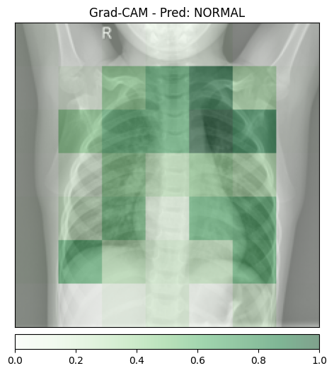
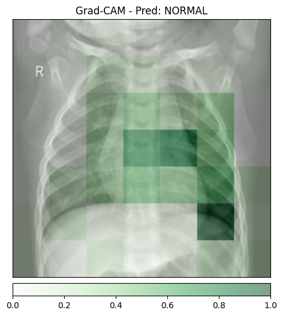
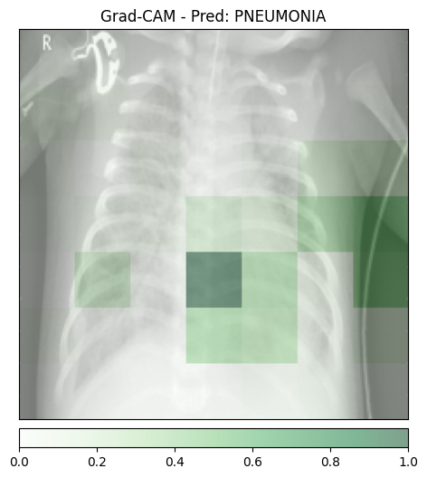
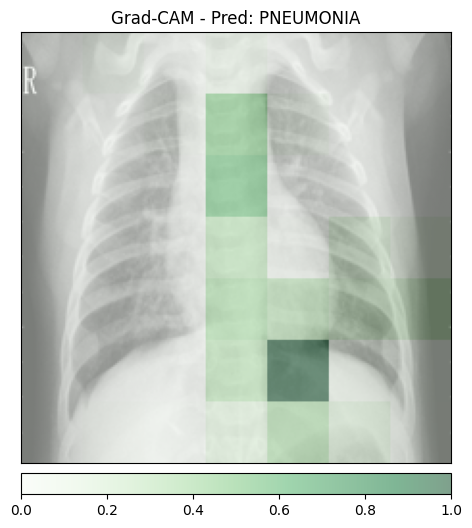
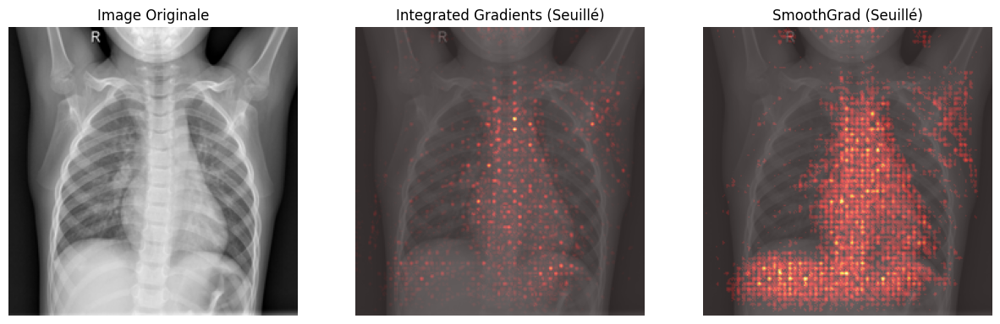
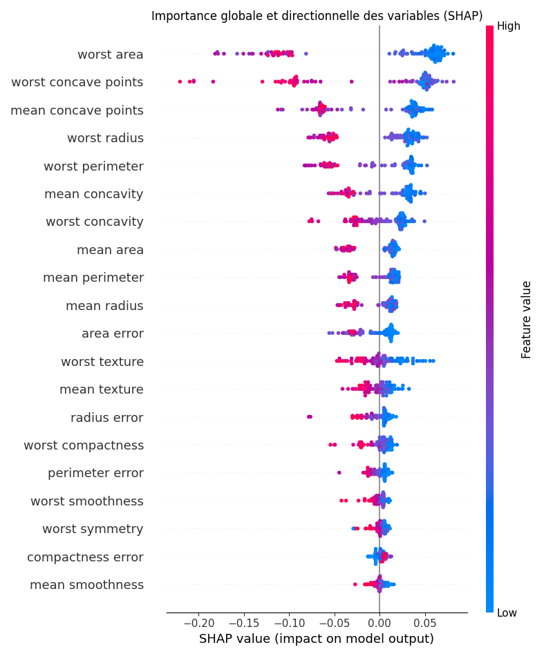

# Exercice 1 : Mise en place, Inférence et Grad-CAM

## Question 1.d.

- Faux positifs : Le modèle prédit NORMAL pour les images saines et PNEUMONIA pour les images non saines.

- Granularité : Les zones colorées semblent être très grandes par rapport à ce que l'on s'attendrait. Le fait que les carrés soient si grands laissent penser à une possibilité d'imprécision.

# Exercice 2 : Integrated Gradients et SmoothGrad

J'ai fait tourner cette fonction sur mon PC portable, et ça a pris environ 5-10 minutes. Il n'est pas envisageable de générer cette explication de manière synchrone vu le temps qu'elle prend. 

En concept, on pourrait proposer une solution qui affiche le résultat de l'inférence en premier lieu pour lecture par l'utilisateur et qui génèrerait l'explication en parallèle puis l'afficherait quand elle serait prête.

Descendre "en-dessous de 0" permet de visualiser les zones qui auraient contribué à faire tourner le résultat dans l'autre sens.

# Exercice 3 : Modélisation Intrinsèquement Interprétable (Glass-box) sur Données Tabulaires

## Question 3.c.

Visiblement, la variable "worst texture" a le plus d'impact, car elle possède le coefficient négatif de plus grande magnitude.

L’avantage d’un modèle directement interprétable est que l’explication est intrinsèque aux paramètres du modèle (les coefficients), ce qui évite les approximations ou artefacts potentiels des méthodes post‑hoc appliquées à des modèles boîte noire.

# Exercice 4 : Explicabilité Post-Hoc avec SHAP sur un Modèle Complexe

## Question 4.c.

- Les variables les plus importantes (worst area, worst concave points et mean concave points) figurent également parmi les plus influentes dans la régression logistique, ce qui indique que ces biomarqueurs sont robustes et informatifs indépendamment du modèle utilisé.

- Pour le patient 0, la caractéristique ayant le plus contribué à la prédiction est worst area, avec une valeur exacte de 677.9, produisant la contribution SHAP la plus élevée (+0.07).